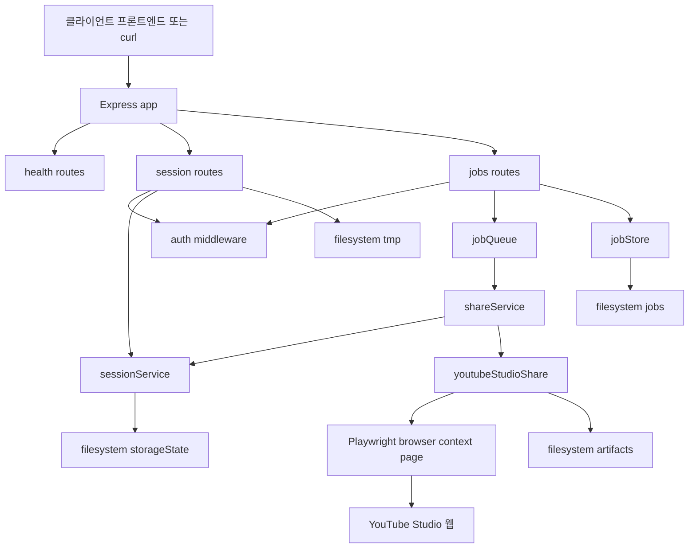
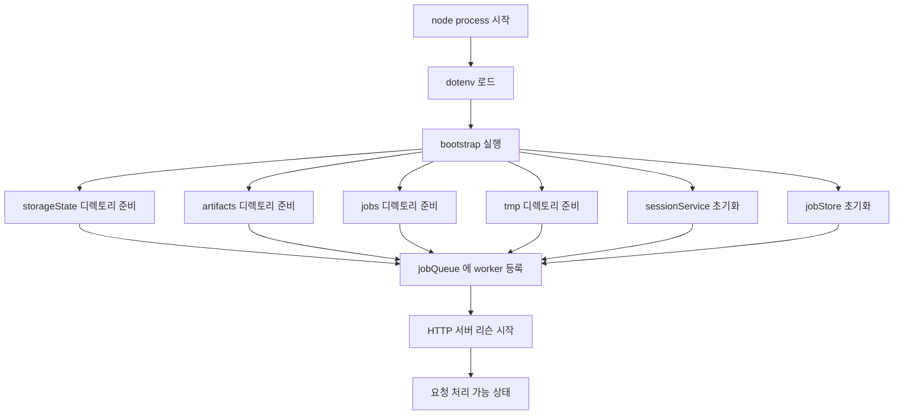
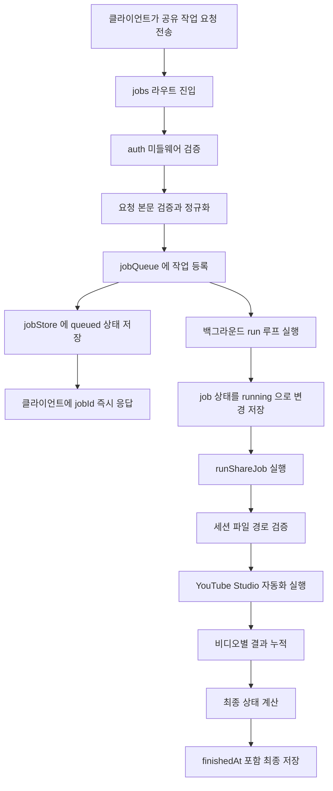
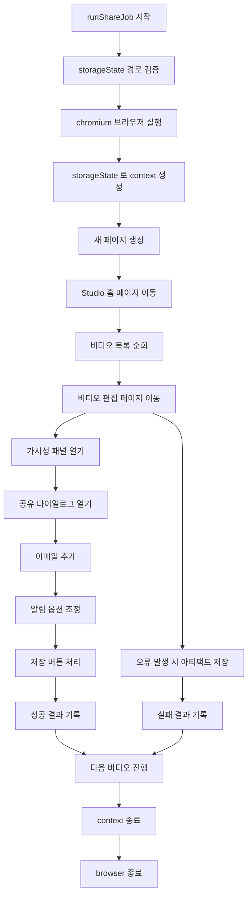
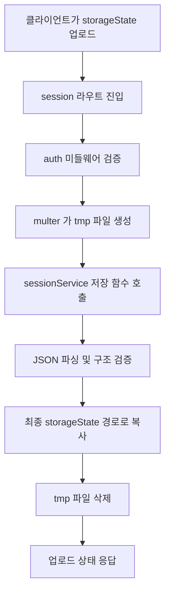
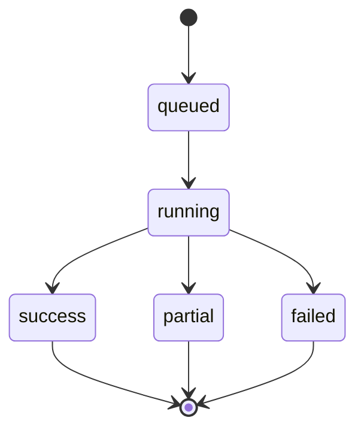

# youtube-private-share-server

Express + Playwright 기반 API 서버입니다. YouTube Studio에서 **Private 비공개 영상의 공유 대상 이메일 추가 자동화**를 브라우저 UI 조작 방식으로 수행합니다.

> 핵심: 브라우저 자동화는 서버에서만 실행되고, 프론트엔드 예시로 Netlify React 앱은 API 호출만 담당합니다.

---

## 1) 프로젝트 한눈에 보기

### 이 서버가 무엇을 하는가
- 클라이언트 프론트엔드 또는 curl이 `POST /api/jobs/share`로 비디오 ID 목록과 공유할 이메일 목록을 보냅니다.
- 서버는 요청을 즉시 실행하지 않고 `jobQueue.enqueue(...)`로 작업을 큐에 넣습니다.
- 큐 Worker는 `runShareJob(...)`를 통해 Playwright 자동화를 수행하고, 비디오별 결과를 수집합니다.
- 처리 결과와 로그는 `data/jobs/<jobId>.json`에 저장되고, 실패 시 아티팩트가 `data/artifacts/<jobId>/`에 저장됩니다.

### 왜 Playwright 자동화가 필요한가
- 이 프로젝트는 공개 API 대신 **YouTube Studio 웹 UI를 직접 조작**하는 전략을 사용합니다.
- 실제 자동화는 `src/services/youtubeStudioShare.js`의 `runYoutubeStudioShare(...)`가 담당합니다.
- 내부에서 `chromium.launch(...)` → `browser.newContext(...)` → `context.newPage()` 흐름으로 브라우저 세션을 열고, 비디오 편집 페이지를 순회합니다.

### 프론트엔드와 서버 역할 분리
- 프론트엔드
  - Bearer 토큰을 포함해 API를 호출합니다.
  - jobId를 받아 상태를 폴링하고 결과를 표시합니다.
- 서버
  - `auth` 미들웨어로 토큰을 검증합니다.
  - 요청 유효성 검증, 큐 관리, 브라우저 자동화, 결과 저장, 아티팩트 다운로드를 제공합니다.

### storageState.json 기반 인증 방식 개요
- 서버는 Google 계정 비밀번호를 직접 저장하지 않습니다.
- 운영자가 `scripts/interactiveLogin.js`로 생성한 storageState JSON을 업로드합니다.
- 업로드된 파일은 `sessionService.saveStorageState(...)`를 거쳐 `config.storageStatePath`로 복사됩니다.
- 작업 실행 시 `sessionService.getStorageStatePathOrThrow()`로 파일 유효성을 확인한 뒤, `browser.newContext({ storageState })`에 주입합니다.

### Job Queue 기반 처리 방식 개요
- 요청 처리와 자동화를 분리하기 위해 `jobQueue`를 사용합니다.
- `enqueue(...)`에서 job JSON을 먼저 저장하고 응답을 즉시 반환합니다.
- 실제 자동화는 백그라운드 `run()` 루프에서 순차 실행됩니다.
- 작업 상태 전이는 `queued` → `running` → `success | partial | failed`입니다.

---

## 2) 전체 아키텍처 설명

아래 다이어그램은 클라이언트 요청부터 Playwright 실행, 파일 저장까지의 연결 구조를 보여줍니다.



### 구성요소별 역할
- 클라이언트 프론트엔드 또는 curl
  - `POST /api/jobs/share`, `GET /api/jobs/:jobId` 같은 HTTP 호출의 시작점입니다.
- Express app (`src/app.js`)
  - CORS와 JSON 파싱을 적용하고, `health`, `session`, `jobs` 라우트를 연결합니다.
- routes (`src/routes/*.js`)
  - `health.js`: 상태 확인 API 제공
  - `session.js`: 세션 업로드 상태 조회 삭제 API 제공
  - `jobs.js`: 작업 생성 조회 아티팩트 다운로드 API 제공
- auth middleware (`src/middleware/auth.js`)
  - Bearer 토큰을 확인하여 보호 라우트 접근을 제한합니다.
- sessionService (`src/services/sessionService.js`)
  - storageState 파일 저장 검증 삭제 상태 조회를 담당합니다.
- jobQueue (`src/services/jobQueue.js`)
  - Job 생성 큐 적재 Worker 실행, 상태 전이, 이력 제한을 담당합니다.
- jobStore (`src/services/jobStore.js`)
  - `data/jobs`에 job JSON 파일 생성 업데이트 조회 목록 조회를 담당합니다.
- shareService (`src/services/shareService.js`)
  - 요청 본문 검증과 상위 작업 실행 함수 `runShareJob(...)`를 제공합니다.
- youtubeStudioShare (`src/services/youtubeStudioShare.js`)
  - Playwright를 통해 YouTube Studio UI를 직접 조작합니다.
- Playwright browser context page
  - 실제 브라우저 세션 컨테이너이며, 비디오별 편집 화면으로 이동해 클릭 입력 저장을 수행합니다.
- filesystem
  - `data/storageState`: 인증 세션 JSON 저장
  - `data/tmp`: 업로드 임시 파일 저장
  - `data/jobs`: 작업 상태 JSON 저장
  - `data/artifacts`: 오류 시 스크린샷 HTML 저장

---

## 3) 서버 시작 시 실행 흐름

서버 부팅은 `src/server.js`의 `bootstrap()`을 중심으로 진행됩니다.

### 서버 부팅 순서도



### 실제 호출 순서와 준비 상태
1. `require('dotenv').config()`
   - `.env` 기반 설정값을 로드합니다.
2. `bootstrap()` 호출
   - 서버 시작 오케스트레이션 진입점입니다.
3. `Promise.all([...])` 병렬 초기화
   - `ensureDir(path.dirname(config.storageStatePath))`
   - `ensureDir(config.artifactsDir)`
   - `ensureDir(config.jobsDir)`
   - `ensureDir(config.tmpDir)`
   - `sessionService.init()`
   - `jobStore.init()`
4. `jobQueue.setWorker(runShareJob)`
   - 큐에서 jobId를 꺼냈을 때 실행할 Worker를 연결합니다.
5. `app.listen(config.port, ...)`
   - HTTP 수신을 시작하고 API가 외부 요청을 받을 수 있는 상태가 됩니다.

---

## 4) HTTP 요청 처리 흐름

이 섹션은 요청이 들어온 뒤 어떤 함수가 어떤 순서로 실행되는지, 그리고 작업 후 어떤 상태가 남는지 설명합니다.

### 4.1 `POST /api/jobs/share` 전체 흐름 다이어그램



### 4.2 함수 호출 순서 상세
1. `src/app.js`
   - `app.use('/api', jobsRoutes)`로 jobs 라우터에 전달됩니다.
2. `src/routes/jobs.js`
   - `router.post('/jobs/share', auth, async ...)` 실행
3. `src/middleware/auth.js`
   - `auth(req, res, next)`가 `Authorization: Bearer ...` 토큰 검사
4. `src/services/shareService.js`
   - `validateShareRequest(req.body)`
   - 내부에서 `videoIds`, `emailsToAdd`, `locale`, `dryRun`, `disableEmailNotification` 검증 및 정규화
5. `src/services/jobQueue.js`
   - `jobQueue.enqueue(payload)`
   - 내부에서 job 객체 생성 후 `jobStore.create(job)` 저장
   - 내부에서 `this.queue.push(job.jobId)`
   - 내부에서 `this.run().catch(...)` 비동기 시작
6. HTTP 응답 반환
   - `{ jobId, status: 'queued' }`
7. 백그라운드 큐 처리
   - `jobQueue.run()`
   - `jobStore.get(jobId)`
   - `job.status = 'running'`, `job.startedAt = ...`, `jobStore.update(job)`
   - `this.worker(this.wrapJob(job))` 호출, Worker는 `runShareJob`
8. `runShareJob(job)`
   - `sessionService.getStorageStatePathOrThrow()`
   - `runYoutubeStudioShare(job, options)`
   - `results` 집계 후 `success | partial | failed` 상태 계산
9. 큐 종료 저장
   - `updatedJob.finishedAt = ...`
   - `jobStore.update(updatedJob)`

### 4.3 작업 종료 후 남는 파일과 상태
- 항상 남는 것
  - `data/jobs/<jobId>.json`
  - 필드: `status`, `createdAt`, `startedAt`, `finishedAt`, `summary`, `results`, `logs`
- 실패가 발생한 비디오가 있을 때 추가로 남는 것
  - `data/artifacts/<jobId>/<videoId>-error.png`
  - `data/artifacts/<jobId>/<videoId>-error.html`
- 응답 가능한 최종 상태
  - `success`: 모든 비디오 성공
  - `partial`: 일부 성공 일부 실패
  - `failed`: 전부 실패 또는 Worker 예외

---

## 5) Playwright 자동화 흐름

### 5.1 자동화 상위 흐름 다이어그램



### 5.2 실제 함수 호출 순서
1. `runShareJob(job)`
   - `sessionService.getStorageStatePathOrThrow()`
   - `runYoutubeStudioShare(job, options)`
2. `runYoutubeStudioShare(job, options)`
   - `chromium.launch({ headless: config.playwrightHeadless })`
   - `browser.newContext({ storageState: options.storageStatePath, locale })`
   - `context.newPage()`
   - `page.goto('https://studio.youtube.com/')`
3. 비디오 루프
   - 각 `videoId`마다 `processVideo(page, job, payload, videoId)` 실행
4. `processVideo(...)`
   - `page.goto('https://studio.youtube.com/video/<videoId>/edit')`
   - `openVisibilityPanel(page, logger)`
   - `UI.privateIndicators` 기준 텍스트 확인
   - `openShareDialog(page, logger)`
   - `addEmails(page, payload.emails, logger, payload.dryRun)`
   - `setNotifyEmail(page, payload.disableEmailNotification, logger, payload.dryRun)`
   - `commitSave(page, payload.dryRun, logger)`
5. 실패 처리
   - `runYoutubeStudioShare(...)` 루프 내부 catch
   - `job.addLog('error', ...)`
   - `saveArtifacts(page, job.jobId, videoId, 'error')`
6. 종료 처리
   - `finally`에서 `context.close()` 후 `browser.close()`

### 5.3 dryRun 동작
- `dryRun: true`면 아래 함수가 실제 UI 저장 동작을 건너뜁니다.
  - `addEmails(...)`
  - `setNotifyEmail(...)`
  - `commitSave(...)`
- 결과 객체는 생성되지만 `addedCount`는 0으로 기록됩니다.

---

## 6) 세션 업로드와 인증 흐름

### 6.1 세션 업로드 다이어그램



### 6.2 실제 호출 순서
1. `router.post('/session/storage-state', auth, upload.single('storageState'), async ...)`
2. `auth(...)` 토큰 검증
3. `multer`가 `config.tmpDir`에 임시 파일 저장
4. `sessionService.saveStorageState(req.file.path)`
   - JSON 파싱
   - `cookies` 배열과 `origins` 배열 검증
   - `fs.copyFile(tempFilePath, config.storageStatePath)`
5. 라우트에서 `fs.unlink(req.file.path)`로 임시 파일 정리
6. 상태 응답 반환

### 6.3 인증 실패 또는 세션 오류 시점
- `auth` 실패 시 `401 UNAUTHORIZED`
- 업로드 파일이 JSON이 아니거나 구조가 잘못되면 `INVALID_STORAGE_STATE`
- 작업 실행 시 storageState가 없으면 `NO_STORAGE_STATE`

---

## 7) Job 상태 전이



### 상태 전이 실제 반영 위치
1. `queued`
   - `jobQueue.enqueue(...)`에서 Job 생성 시 설정
2. `running`
   - `jobQueue.run()`에서 Worker 실행 직전 설정
3. `success | partial | failed`
   - `runShareJob(...)`가 `results` 집계 후 결정
4. Worker 예외로 인한 `failed`
   - `jobQueue.run()`의 catch 블록에서 설정

---

## 8) 주요 API와 내부 연결

| API | 라우트 정의 | 인증 | 핵심 내부 호출 | 결과 |
|---|---|---|---|---|
| `GET /health` | `src/routes/health.js` | 불필요 | `config.serviceName`, `config.version` | 서버 상태 JSON |
| `GET /api/session/status` | `src/routes/session.js` | 필요 | `sessionService.getStatus()` | 세션 존재 여부 |
| `POST /api/session/storage-state` | `src/routes/session.js` | 필요 | `upload.single(...)`, `sessionService.saveStorageState(...)` | storageState 업로드 |
| `DELETE /api/session/storage-state` | `src/routes/session.js` | 필요 | `sessionService.deleteStorageState()` | storageState 삭제 |
| `POST /api/jobs/share` | `src/routes/jobs.js` | 필요 | `validateShareRequest(...)`, `jobQueue.enqueue(...)` | jobId 반환 |
| `GET /api/jobs` | `src/routes/jobs.js` | 필요 | `jobStore.list(limit)` | 작업 목록 |
| `GET /api/jobs/:jobId` | `src/routes/jobs.js` | 필요 | `jobStore.get(jobId)` | 단일 작업 상세 |
| `GET /api/jobs/:jobId/artifacts/:fileName` | `src/routes/jobs.js` | 필요 | `fs.access(...)`, `res.download(...)` | 아티팩트 파일 다운로드 |

---

## 9) 프로젝트 구조

```text
.
├─ package.json
├─ Dockerfile
├─ .env.example
├─ src
│  ├─ app.js
│  ├─ server.js
│  ├─ config.js
│  ├─ middleware
│  │  ├─ auth.js
│  │  └─ errorHandler.js
│  ├─ routes
│  │  ├─ health.js
│  │  ├─ session.js
│  │  └─ jobs.js
│  ├─ services
│  │  ├─ jobQueue.js
│  │  ├─ jobStore.js
│  │  ├─ sessionService.js
│  │  ├─ shareService.js
│  │  └─ youtubeStudioShare.js
│  └─ utils
│     ├─ fs.js
│     └─ logger.js
├─ scripts
│  └─ interactiveLogin.js
└─ data
   └─ .gitkeep
```

실행 중 생성 사용되는 저장 경로:
- `data/storageState/storageState.json`
- `data/jobs/<jobId>.json`
- `data/artifacts/<jobId>/*`
- `data/tmp/*`

---

## 10) 환경 변수

`.env.example` 기준:

- `PORT=3000`
- `ADMIN_TOKEN=change-me`
- `ALLOWED_ORIGINS=https://your-netlify-site.netlify.app`
- `STORAGE_STATE_PATH=./data/storageState/storageState.json`
- `ARTIFACTS_DIR=./data/artifacts`
- `JOBS_DIR=./data/jobs`
- `TMP_DIR=./data/tmp`
- `PLAYWRIGHT_HEADLESS=true`
- `DEFAULT_LOCALE=auto`
- `JOB_HISTORY_LIMIT=100`
- `JOB_POLL_INTERVAL_MS=500`

---

## 11) 로컬 실행

```bash
npm install
cp .env.example .env
npm run dev
```

---

## 12) storageState 생성과 업로드

### 12.1 로컬에서 storageState 생성

```bash
npm run interactive-login
```

진행 방식:
1. 브라우저가 열리고 `https://studio.youtube.com/`로 이동합니다.
2. 운영자가 직접 Google 로그인과 2FA를 완료합니다.
3. 터미널 Enter 입력 시 `config.storageStatePath`에 세션이 저장됩니다.

### 12.2 서버에 업로드

```bash
curl -X POST "http://localhost:3000/api/session/storage-state" \
  -H "Authorization: Bearer change-me" \
  -F "storageState=@./data/storageState/storageState.json;type=application/json"
```

---

## 13) API 계약 예시

### `GET /health`

```json
{
  "ok": true,
  "service": "youtube-private-share-server",
  "version": "1.0.0"
}
```

### `GET /api/session/status`

```json
{
  "authenticated": true,
  "hasStorageState": true,
  "updatedAt": "2026-04-02T00:00:00.000Z"
}
```

### `POST /api/jobs/share` 요청 예시

```json
{
  "videoIds": ["AbCdEf12345", "ZzYyXx12345"],
  "emailsToAdd": ["a@gmail.com", "b@gmail.com"],
  "disableEmailNotification": true,
  "dryRun": false,
  "locale": "auto"
}
```

### `POST /api/jobs/share` 응답 예시

```json
{
  "jobId": "job_abc123def456",
  "status": "queued"
}
```

### `GET /api/jobs/:jobId` 결과 예시 핵심 필드

```json
{
  "jobId": "job_abc123def456",
  "status": "partial",
  "createdAt": "2026-04-02T00:00:00.000Z",
  "startedAt": "2026-04-02T00:00:02.000Z",
  "finishedAt": "2026-04-02T00:01:10.000Z",
  "summary": {
    "totalVideos": 2,
    "successCount": 1,
    "failedCount": 1
  },
  "results": [],
  "logs": []
}
```
