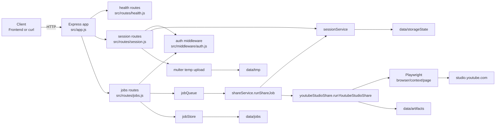
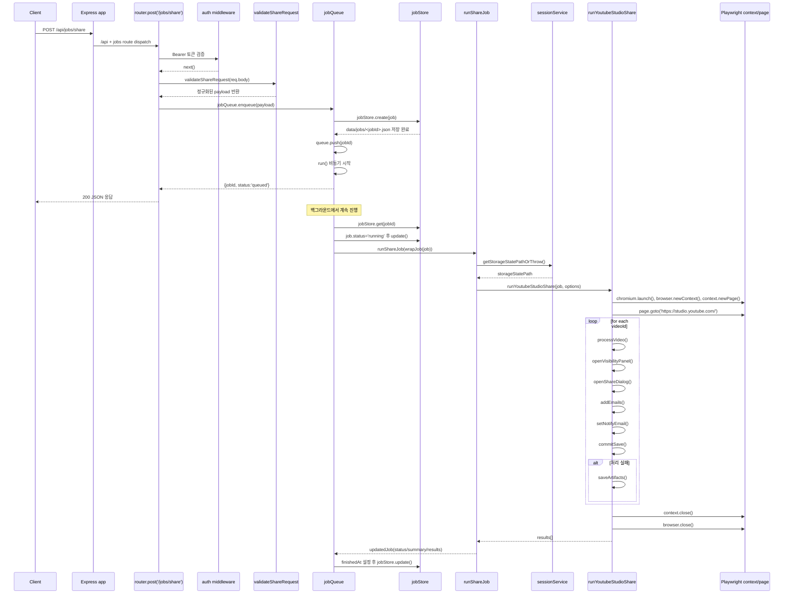
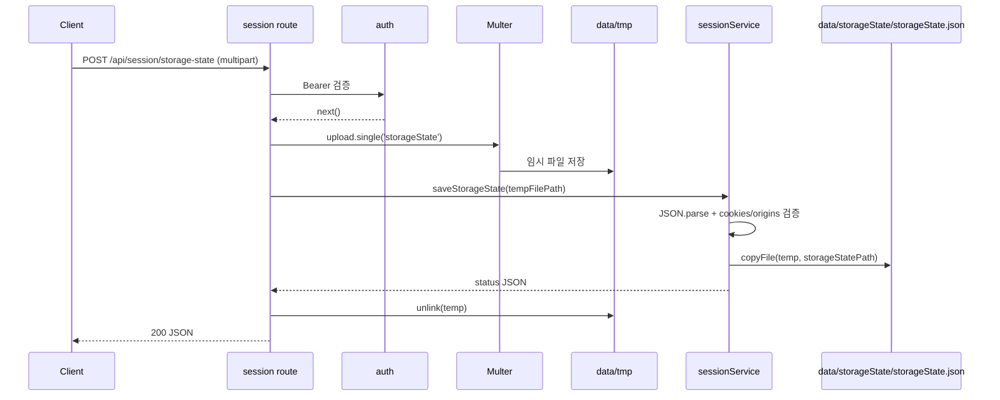
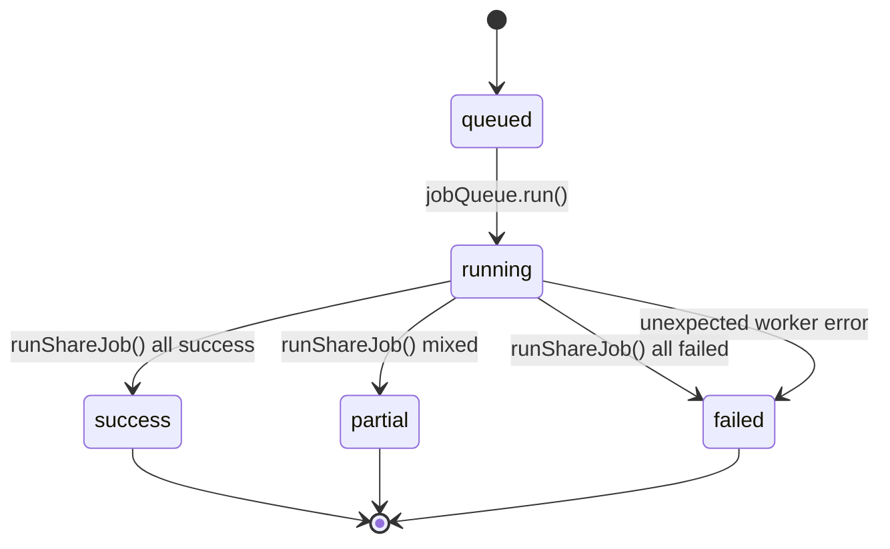

# youtube-private-share-server

Express + Playwright 기반 API 서버입니다. YouTube Studio에서 **Private(비공개) 영상의 공유 대상 이메일 추가 자동화**를 브라우저 UI 조작 방식으로 수행합니다.

> 핵심: 브라우저 자동화는 서버에서만 실행되고, 프론트엔드(예: Netlify React 앱)는 API 호출만 담당합니다.

---

## 1) 프로젝트 한눈에 보기

### 이 서버가 하는 일
- 클라이언트(프론트엔드, curl 등)로부터 YouTube 비디오 ID 목록 + 공유할 이메일 목록을 받습니다.
- 작업(Job)을 큐에 넣고, 백그라운드 Worker가 순차 처리합니다.
- 각 비디오에 대해 YouTube Studio 편집 화면으로 이동하여 “비공개 공유(Share privately)” UI를 자동 조작합니다.
- 작업 상태(`queued`, `running`, `success`, `partial`, `failed`)와 로그/결과/아티팩트를 조회 API로 제공합니다.

### 왜 Playwright 브라우저 자동화가 필요한가
- YouTube Studio의 비공개 공유 편집은 공개 API만으로 안정적으로 대체하기 어렵습니다.
- 이 프로젝트는 서버에서 Playwright로 실제 Studio 웹 UI를 조작하여 기능을 수행합니다.
- 따라서 브라우저 자동화 로직은 `src/services/youtubeStudioShare.js`에 집중되어 있습니다.

### 프론트엔드와 서버의 역할 분리
- **프론트엔드**: 토큰 포함 API 호출, 작업 생성/조회 UI 제공.
- **서버**: 인증 토큰 검증, 요청 유효성 검사, Job Queue 관리, Playwright 실행, 결과/로그/아티팩트 저장.

### `storageState.json` 기반 인증 방식 개요
- Google 계정 아이디/비밀번호를 서버에 저장하지 않습니다.
- 로컬/운영자 환경에서 만든 Playwright `storageState.json`을 서버로 업로드합니다.
- 서버는 해당 파일 경로를 `sessionService.getStorageStatePathOrThrow()`로 검증 후 Playwright `browser.newContext({ storageState })`에 주입합니다.

### Job Queue 기반 처리 방식 개요
- `POST /api/jobs/share` 요청이 들어오면 즉시 처리하지 않고 `jobQueue.enqueue(...)`로 큐에 적재합니다.
- `jobQueue.run()` 루프가 대기열에서 하나씩 꺼내 Worker(`runShareJob`)를 실행합니다.
- 작업 단위 결과는 `data/jobs/<jobId>.json` 파일로 저장/갱신됩니다.

---

## 2) 전체 아키텍처 설명

아래 구성요소가 요청 처리 시 어떻게 연결되는지 요약합니다.

- 클라이언트(프론트엔드/curl)
- Express app (`src/app.js`)
- routes (`src/routes/*.js`)
- auth middleware (`src/middleware/auth.js`)
- `sessionService`
- `jobQueue`
- `jobStore`
- `shareService`
- `youtubeStudioShare`
- Playwright browser/context/page
- filesystem (`data/jobs`, `data/artifacts`, `data/storageState`, `data/tmp`)



---

## 3) 서버 시작 시 실행 흐름

서버 프로세스 시작 시 실제 호출 순서는 `src/server.js` 기준 아래와 같습니다.

1. `require('dotenv').config()`로 환경 변수 로드
2. `bootstrap()` 호출
3. `Promise.all([...])` 내부에서 초기화 병렬 수행
   - `ensureDir(path.dirname(config.storageStatePath))`
   - `ensureDir(config.artifactsDir)`
   - `ensureDir(config.jobsDir)`
   - `ensureDir(config.tmpDir)`
   - `sessionService.init()`
   - `jobStore.init()`
4. `jobQueue.setWorker(runShareJob)`로 큐 Worker 바인딩
5. `app.listen(config.port, ...)`로 HTTP 수신 시작

### 서버 부팅 순서도

```mermaid
flowchart TD
    S0[node process 시작] --> S1[dotenv config 로드]
    S1 --> S2[bootstrap 호출]
    S2 --> S3[ensureDir: storageState 디렉토리]
    S2 --> S4[ensureDir: artifacts 디렉토리]
    S2 --> S5[ensureDir: jobs 디렉토리]
    S2 --> S6[ensureDir: tmp 디렉토리]
    S2 --> S7[sessionService.init]
    S2 --> S8[jobStore.init]
    S3 --> S9[jobQueue.setWorker(runShareJob)]
    S4 --> S9
    S5 --> S9
    S6 --> S9
    S7 --> S9
    S8 --> S9
    S9 --> S10[app.listen(port)]
    S10 --> S11[요청 처리 가능 상태]
```

### 단계별 준비 상태
- 디렉토리 준비: 이후 Job JSON/아티팩트/업로드 임시파일 저장 가능 상태.
- 세션 서비스 준비: storageState 파일 경로 접근 전제 준비.
- Job 스토어 준비: `data/jobs`에 create/update/get/list 가능 상태.
- 큐 Worker 준비: 큐가 jobId를 꺼낼 때 `runShareJob` 실행 가능 상태.

---

## 4) 요청 처리 메인 흐름: `POST /api/jobs/share`

이 섹션은 “HTTP 요청이 들어와서 종료될 때까지”를 가장 상세히 설명합니다.

### A. Mermaid Sequence Diagram



### B. 함수 호출 순서 리스트

`POST /api/jobs/share` 요청 1건 기준의 핵심 호출 순서입니다.

1. `src/app.js`
   - `app.use('/api', jobsRoutes)` 라우팅
2. `src/routes/jobs.js`
   - `router.post('/jobs/share', auth, async ...)`
3. `src/middleware/auth.js`
   - `auth(req, res, next)`
4. `src/services/shareService.js`
   - `validateShareRequest(req.body)`
5. `src/services/jobQueue.js`
   - `jobQueue.enqueue(payload)`
   - 내부에서 `jobStore.create(job)`
   - 내부에서 `this.queue.push(job.jobId)`
   - 내부에서 `this.run().catch(...)` 호출
6. 즉시 HTTP 응답 반환
   - `{ jobId, status: 'queued' }`
7. 백그라운드 큐 실행 (`jobQueue.run()`)
   - `jobStore.get(jobId)`
   - `job.status='running'; job.startedAt=...; jobStore.update(job)`
   - `this.worker(this.wrapJob(job))` → `runShareJob(...)`
8. `runShareJob(job)` 내부
   - `sessionService.getStorageStatePathOrThrow()`
   - `runYoutubeStudioShare(job, options)`
9. `runYoutubeStudioShare(...)` 내부
   - `chromium.launch(...)`
   - `browser.newContext({ storageState, locale })`
   - `context.newPage()`
   - `page.goto('https://studio.youtube.com/')`
   - videoIds 루프마다 `processVideo(...)`
10. `processVideo(...)` 내부
    - `page.goto(video edit URL)`
    - `openVisibilityPanel(...)`
    - `openShareDialog(...)`
    - `addEmails(...)`
    - `setNotifyEmail(...)`
    - `commitSave(...)`
11. 비디오 실패 시
    - `saveArtifacts(...)`
12. 종료 정리
    - `context.close()`
    - `browser.close()`
13. 큐 종료 저장
    - `updatedJob.finishedAt=...; jobStore.update(updatedJob)`

### C. 단계별 상세 설명

#### 1) 라우트 진입 + 인증 + 요청 검증
- `/api/jobs/share`는 `router.post('/jobs/share', auth, ...)`에서 처리됩니다.
- `auth` 미들웨어가 Bearer 토큰을 검사합니다.
- 본문은 `validateShareRequest(...)`에서 정규화/검증됩니다.
  - `videoIds`, `emailsToAdd` 배열 중복 제거
  - 이메일 소문자화
  - `videoIds` 패턴/이메일 정규식 검증
  - `locale`이 `auto|ko|en`인지 확인

#### 2) Job 객체 생성 + job JSON 파일 저장 시점
- `jobQueue.enqueue(payload)`에서 Job 객체가 생성됩니다.
  - `jobId`, `status='queued'`, `createdAt`, `summary`, `results`, `logs` 포함
- **즉시** `jobStore.create(job)`가 호출되어 `data/jobs/<jobId>.json`이 저장됩니다.
- 그 후 큐에 jobId를 넣고 `jobQueue.run()`을 비동기로 트리거합니다.
- API 응답은 큐 적재 완료 시점에 반환되므로 빠르게 종료됩니다.

#### 3) 큐 실행 + Worker 연결
- `jobQueue.run()`은 `running` 플래그로 중복 실행을 방지합니다.
- 큐에서 꺼낸 jobId에 대해 `jobStore.get(jobId)` 수행.
- 작업 상태를 `running`으로 바꿔 `jobStore.update(job)` 저장.
- `jobQueue.setWorker(runShareJob)`로 등록된 Worker를 호출합니다.

#### 4) Worker 내부 처리
- `runShareJob(job)`에서 먼저 `sessionService.getStorageStatePathOrThrow()`를 호출하여 세션 파일 유효성을 검사합니다.
- 이후 `runYoutubeStudioShare(job, options)`를 호출합니다.
- 반환된 `results`를 기반으로
  - 성공 전부: `success`
  - 일부 실패: `partial`
  - 전부 실패: `failed`
  를 결정합니다.

#### 5) Playwright 열고 닫는 위치
- 열기: `runYoutubeStudioShare(...)` 시작부
  - `chromium.launch(...)`
  - `browser.newContext(...)`
  - `context.newPage()`
- 닫기: `runYoutubeStudioShare(...)`의 `finally`
  - `await context.close()`
  - `await browser.close()`

#### 6) 비디오 단위 처리 + 결과/로그/artifact 누적
- `options.videoIds`를 순회하며 `processVideo(...)`를 호출합니다.
- 성공 시 `{status:'success', addedCount, message, artifacts:[]}`를 `results`에 push.
- 실패 시
  - `job.addLog('error', ...)` 기록
  - `saveArtifacts(...)`로 screenshot/html 저장
  - 실패 결과 객체(`status:'failed'`, artifacts URL 포함)를 `results`에 push.
- 즉, `results[]`와 `logs[]`는 video 루프를 돌며 누적됩니다.

#### 7) 작업 종료 후 Job JSON 갱신
- Worker 완료 후 `jobQueue.run()`이 `finishedAt`을 설정하고 `jobStore.update(updatedJob)`를 호출합니다.
- 최종 job JSON에는 상태/요약/결과/로그/종료시각이 반영됩니다.

---

## 5) 비디오 1개 처리 흐름 상세 설명 (`runYoutubeStudioShare` 내부)

`processVideo(page, job, payload, videoId)` 기준으로 설명합니다.

### 단계
1. Studio 비디오 편집 URL 이동
   - `https://studio.youtube.com/video/<videoId>/edit`
2. Visibility 패널 열기
   - `openVisibilityPanel(...)`
3. Private 상태 텍스트 탐색
   - `UI.privateIndicators` 패턴으로 탐지
4. Share dialog 열기
   - `openShareDialog(...)`
5. 이메일 추가
   - `addEmails(...)`
6. 이메일 알림 체크박스 조정
   - `setNotifyEmail(...)`
7. 저장
   - `commitSave(...)`
8. 성공 결과 반환

실패 시:
- 예외를 상위 루프에서 잡아 `saveArtifacts(...)` 호출 후 failed 결과 반환.

`dryRun=true`일 때 실제 저장/변경이 건너뛰는 함수:
- `addEmails(...)`
- `setNotifyEmail(...)`
- `commitSave(...)`

```mermaid
sequenceDiagram
    participant Loop as runYoutubeStudioShare loop
    participant PV as processVideo
    participant Page as Playwright page

    Loop->>PV: processVideo(page, job, payload, videoId)
    PV->>Page: goto(video edit URL)
    PV->>PV: openVisibilityPanel()
    PV->>PV: private indicator 확인
    PV->>PV: openShareDialog()
    PV->>PV: addEmails()
    PV->>PV: setNotifyEmail()
    PV->>PV: commitSave()
    PV-->>Loop: success result

    Note over PV: 예외 발생 시 runYoutubeStudioShare에서 catch
    Loop->>PV: saveArtifacts(page, jobId, videoId, 'error')
    Loop-->>Loop: failed result push
```

---

## 6) 세션 업로드 흐름 (`POST /api/session/storage-state`)

### 처리 순서
1. 라우트: `router.post('/session/storage-state', auth, upload.single('storageState'), ...)`
2. `auth`로 토큰 검증
3. `multer`가 `config.tmpDir`에 임시 파일 저장
4. 핸들러에서 `req.file` 존재 확인
5. `sessionService.saveStorageState(req.file.path)` 호출
   - JSON 파싱
   - `cookies`, `origins` 배열 존재 검증
   - 최종 경로(`config.storageStatePath`)로 copy
   - 상태 반환
6. 라우트에서 임시 파일 삭제(`fs.unlink(req.file.path)`)
7. 응답 반환



### `INVALID_STORAGE_STATE` 발생 케이스
- 업로드 파일 확장자가 `.json`이 아닌 경우(`multer.fileFilter`).
- JSON 파싱 실패(`Invalid JSON file`).
- 파싱 결과에 `cookies`/`origins` 배열이 없는 경우.
- 저장된 storageState를 사용하는 시점(`getStorageStatePathOrThrow`)에 구조가 깨진 경우.

---

## 7) 조회 API 흐름 요약

| API | 라우트 | 내부 호출 | 응답 구성 |
|---|---|---|---|
| `GET /health` | `src/routes/health.js` | `config.serviceName`, `config.version` 참조 | `{ ok, service, version }` |
| `GET /api/session/status` | `src/routes/session.js` + `auth` | `sessionService.getStatus()` | `{ authenticated, hasStorageState, updatedAt }` |
| `GET /api/jobs` | `src/routes/jobs.js` + `auth` | `jobStore.list(limit)` 후 `toJobListItem` 매핑 | `{ items: [...] }` |
| `GET /api/jobs/:jobId` | `src/routes/jobs.js` + `auth` | `jobStore.get(jobId)` | Job 전체 JSON 또는 `JOB_NOT_FOUND` |
| `GET /api/jobs/:jobId/artifacts/:fileName` | `src/routes/jobs.js` + `auth` | `fs.access(artifactPath)` 후 `res.download(...)` | 파일 다운로드 또는 `ARTIFACT_NOT_FOUND` |

---

## 8) 함수/파일 매핑 표

| 파일 경로 | 주요 함수명 | 역할 | 언제 호출되는지 |
|---|---|---|---|
| `src/server.js` | `bootstrap()` | 서버 부팅/초기화 오케스트레이션 | 프로세스 시작 직후 |
| `src/app.js` | `app.use(...)` 등록 체인 | 미들웨어/라우트 구성 | 모든 HTTP 요청 진입 시 |
| `src/routes/jobs.js` | `router.post('/jobs/share', ...)`, `router.get('/jobs', ...)`, `router.get('/jobs/:jobId', ...)`, `router.get('/jobs/:jobId/artifacts/:fileName', ...)` | Job 생성/조회/아티팩트 다운로드 API | `/api/jobs*` 요청 시 |
| `src/routes/session.js` | `router.get('/session/status', ...)`, `router.post('/session/storage-state', ...)`, `router.delete('/session/storage-state', ...)` | 세션 파일 상태/업로드/삭제 API | `/api/session*` 요청 시 |
| `src/services/jobQueue.js` | `setWorker()`, `enqueue()`, `run()`, `wrapJob()`, `enforceJobLimit()` | Job 큐 적재 및 Worker 실행 | `POST /jobs/share` 이후 백그라운드 |
| `src/services/jobStore.js` | `init()`, `create()`, `update()`, `get()`, `list()` | Job JSON 파일 저장소 | 큐/조회 API 처리 중 |
| `src/services/shareService.js` | `validateShareRequest()`, `runShareJob()` | 요청 검증 및 공유 작업 상위 로직 | Job 생성 시/Worker 실행 시 |
| `src/services/youtubeStudioShare.js` | `runYoutubeStudioShare()`, `processVideo()`, `openVisibilityPanel()`, `openShareDialog()`, `addEmails()`, `setNotifyEmail()`, `commitSave()`, `saveArtifacts()` | Playwright UI 자동화의 핵심 구현 | Worker 내부에서 비디오 처리 시 |
| `src/services/sessionService.js` | `init()`, `getStatus()`, `saveStorageState()`, `deleteStorageState()`, `getStorageStatePathOrThrow()` | storageState 관리/검증 | 세션 API 및 share Worker에서 |
| `src/middleware/auth.js` | `auth()` | Bearer 토큰 인증 | 보호 라우트 진입 시 |
| `src/middleware/errorHandler.js` | `errorHandler()` | 에러 JSON 표준 응답 변환 | 라우트/미들웨어 에러 발생 시 |

---

## 9) Job 상태 전이 설명

상태 값: `queued`, `running`, `success`, `partial`, `failed`

- `queued`
  - 설정 위치: `jobQueue.enqueue()`에서 초기 Job 생성 시.
- `running`
  - 설정 위치: `jobQueue.run()`에서 Worker 호출 직전.
- `success`/`partial`/`failed`
  - 설정 위치: `runShareJob()`에서 `results` 기반 계산.
- Worker 예외로 인한 `failed`
  - 설정 위치: `jobQueue.run()`의 catch 블록.



---

## 10) 로그와 artifact 생성 시점

### `job.addLog(...)` 사용 지점
- `runYoutubeStudioShare()` 시작 후 Studio 홈 진입 성공 로그
  - `job.addLog('info', 'Opened Studio home page')`
- 각 동작 함수에서 `payload.logger.info/warn`를 통해 간접 호출
  - 예: `openVisibilityPanel`, `openShareDialog`, `addEmails`, `setNotifyEmail`, `commitSave`
- 비디오별 예외 발생 시
  - `job.addLog('error', `[${videoId}] ${error.message}`)`
- Worker 전체 예외 시 (`jobQueue.run()` catch)
  - `Unexpected worker error: ...`

### artifact(screenshot/html) 생성 지점
- 함수: `saveArtifacts(page, jobId, videoId, prefix)`
- 호출 조건: `runYoutubeStudioShare()`의 video 루프에서 `processVideo()` 실패 시.
- 생성 파일:
  - `${videoId}-${prefix}.png`
  - `${videoId}-${prefix}.html`
- 저장 경로:
  - 실제 파일: `data/artifacts/<jobId>/<fileName>`
  - 응답 URL: `/api/jobs/<jobId>/artifacts/<fileName>`

---

## 11) 실제 요청 예시 기준 Walkthrough

예시 요청:

```json
{
  "videoIds": ["AbCdEf12345", "ZzYyXx12345"],
  "emailsToAdd": ["a@gmail.com", "b@gmail.com"],
  "disableEmailNotification": true,
  "dryRun": false,
  "locale": "auto"
}
```

### 실제로 벌어지는 일 (스토리)
1. 클라이언트가 `POST /api/jobs/share` 호출.
2. 서버는 토큰 인증(`auth`)을 통과시키고 요청 바디를 `validateShareRequest()`로 정제.
3. `jobQueue.enqueue()`가 `job_xxxxx`를 만들고 `data/jobs/job_xxxxx.json` 파일을 즉시 저장.
4. API는 즉시 `{ jobId, status: 'queued' }`를 반환.
5. 백그라운드에서 `jobQueue.run()`이 해당 job을 꺼내 `running`으로 바꾸고 저장.
6. `runShareJob()`가 세션 파일(`storageState.json`) 유효성을 확인.
7. `runYoutubeStudioShare()`가 브라우저/컨텍스트/페이지를 열고 Studio 홈에 진입.
8. 첫 번째 비디오(`AbCdEf12345`) 처리:
   - edit URL 이동 → visibility 열기 → share dialog 열기 → 이메일 2개 추가 → 알림 비활성화 상태로 체크박스 조정 → 저장.
9. 두 번째 비디오(`ZzYyXx12345`)도 같은 절차 수행.
10. 도중 특정 비디오에서 오류가 나면 해당 비디오만 failed로 기록하고 screenshot/html 아티팩트를 저장.
11. 전체 비디오 처리 후 context/browser를 닫음.
12. `runShareJob()`가 결과 집계를 계산:
   - 둘 다 성공이면 `success`
   - 하나 성공/하나 실패면 `partial`
   - 둘 다 실패면 `failed`
13. `jobQueue.run()`이 `finishedAt`과 최종 상태/요약/결과/로그를 job JSON에 업데이트.
14. 이후 클라이언트는 `GET /api/jobs/:jobId`로 상세 결과, 필요 시 artifacts API로 증적 파일을 다운로드.

---

## 프로젝트 구조

```text
.
├─ package.json
├─ Dockerfile
├─ .env.example
├─ src
│  ├─ app.js
│  ├─ server.js
│  ├─ config.js
│  ├─ middleware
│  │  ├─ auth.js
│  │  └─ errorHandler.js
│  ├─ routes
│  │  ├─ health.js
│  │  ├─ session.js
│  │  └─ jobs.js
│  ├─ services
│  │  ├─ jobQueue.js
│  │  ├─ jobStore.js
│  │  ├─ sessionService.js
│  │  ├─ shareService.js
│  │  └─ youtubeStudioShare.js
│  └─ utils
│     ├─ fs.js
│     └─ logger.js
├─ scripts
│  └─ interactiveLogin.js
└─ data
   └─ .gitkeep
```

실행 중 생성/사용되는 저장 경로:

- `data/storageState/storageState.json`
- `data/jobs/<jobId>.json`
- `data/artifacts/<jobId>/*`
- `data/tmp/*`

---

## 환경 변수

`.env.example` 참고:

- `PORT=3000`
- `ADMIN_TOKEN=change-me`
- `ALLOWED_ORIGINS=https://your-netlify-site.netlify.app`
- `STORAGE_STATE_PATH=./data/storageState/storageState.json`
- `ARTIFACTS_DIR=./data/artifacts`
- `JOBS_DIR=./data/jobs`
- `TMP_DIR=./data/tmp`
- `PLAYWRIGHT_HEADLESS=true`
- `DEFAULT_LOCALE=auto`
- `JOB_HISTORY_LIMIT=100`

---

## 로컬 실행

```bash
npm install
cp .env.example .env
npm run dev
```

---

## storageState 기반 인증 방식

운영 서버에서 Google 로그인 UI를 직접 띄우는 방식 대신, 인증된 Playwright `storageState.json`을 업로드해 재사용합니다.

### 1) 로컬에서 storageState 생성

```bash
npm run interactive-login
```

- 브라우저가 열리면 Google 로그인/2FA 포함 수동 완료
- Studio 진입 확인 후 터미널에서 Enter
- `STORAGE_STATE_PATH`에 세션 파일 저장

### 2) 서버에 업로드

```bash
curl -X POST "http://localhost:3000/api/session/storage-state" \
  -H "Authorization: Bearer change-me" \
  -F "storageState=@./data/storageState/storageState.json;type=application/json"
```

---

## API 계약

### `GET /health`

```json
{
  "ok": true,
  "service": "youtube-private-share-server",
  "version": "1.0.0"
}
```

### `GET /api/session/status` (Bearer 필요)

```json
{
  "authenticated": true,
  "hasStorageState": true,
  "updatedAt": "2026-04-02T12:00:00.000Z"
}
```

### `POST /api/session/storage-state` (Bearer 필요)

- multipart/form-data
- file field: `storageState`

### `DELETE /api/session/storage-state` (Bearer 필요)

저장된 세션 파일 삭제.

### `POST /api/jobs/share` (Bearer 필요)

요청 예시:

```json
{
  "videoIds": ["AbCdEf12345"],
  "emailsToAdd": ["a@gmail.com", "b@gmail.com"],
  "disableEmailNotification": true,
  "dryRun": false,
  "locale": "auto"
}
```

응답 예시:

```json
{
  "jobId": "job_xxx",
  "status": "queued"
}
```

### `GET /api/jobs` (Bearer 필요)

최근 작업 목록(최신순).

### `GET /api/jobs/:jobId` (Bearer 필요)

작업 상세:

- jobId
- status (`queued | running | success | partial | failed`)
- createdAt / startedAt / finishedAt
- request
- summary
- results
- logs

### `GET /api/jobs/:jobId/artifacts/:fileName` (Bearer 필요)

작업 중 생성된 스크린샷/HTML 아티팩트 다운로드.

---

## 표준 에러 응답

```json
{
  "error": {
    "code": "INVALID_REQUEST",
    "message": "videoIds is required"
  }
}
```

---

## 자동화 동작 개요

- Studio 페이지로 이동
- Visibility/Private 관련 UI 확인
- Share privately 진입
- 이메일 입력 + 중복 제거(요청 단계)
- 이메일 알림 옵션 반영
- 저장
- 실패 시 screenshot + HTML 스냅샷 저장

영어/한국어 UI 라벨 텍스트를 일부 패턴으로 대응하며, selector 패턴은 `src/services/youtubeStudioShare.js`에 집중되어 있습니다. UI 변경 시 이 파일을 우선 수정하세요.

---

## 보안 주의사항

- `ADMIN_TOKEN`은 반드시 강력한 값 사용
- `ALLOWED_ORIGINS`를 Netlify 배포 도메인으로 제한
- 업로드된 `storageState.json`은 민감정보이므로 접근권한/볼륨 보안 필수
- 로그에 이메일 전체를 남기지 않고 일부 마스킹 처리

---

## Render / Railway 배포 가이드

### Docker 기반 배포

이 저장소는 Playwright 공식 이미지 기반 Dockerfile을 포함합니다.
